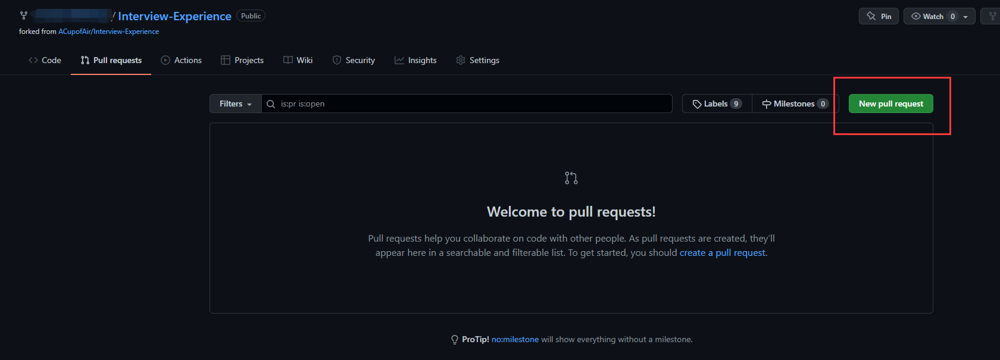
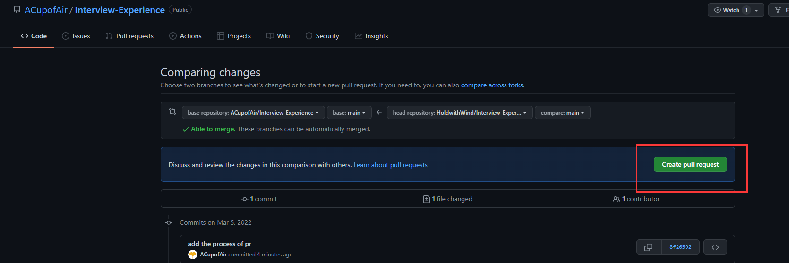

# 东南大学 2023 届面试经验分享

## 面试经历列表

| 链接                                                                    |   日期    |   公司    | 岗位 |
| :---------------------------------------------------------------------- | :-------: | :-------: | :--: |
| [:link:钉钉前端一面-wj-爆炸](./doc/wj_dingding_fontend.md)              | 2022-2-21 |   钉钉    | 前端 |
| [:link:钉钉前端一面-byc（60 分钟）-凉了](./doc/byc_dingding_fontend.md) | 2022-2-24 |   钉钉    | 前端 |
| [:link:飞书后端一面-wbj](./doc/wbj_bytedance_backend.md)                | 2022-2-25 | 字节-飞书 | 后端 |
| [:link:字节前端一面-byc(50min) -凉了](./doc/byc_bytedance_fontend.md)   | 2022-2-28 | 字节-电商 | 前端 |
| [:link:字节前端一面-xr-寄](./doc/xr_bytedance_fontend.md)               | 2022-3-4  | 字节-电商 | 前端 |

## 有问题欢迎讨论

- 如何提问
  - [参考这篇文章](https://github.com/ryanhanwu/How-To-Ask-Questions-The-Smart-Way/blob/main/README-zh_CN.md)（我没读过，但觉得表达你的意思即可）
- 利用 issues，讨论问题

## 如何贡献你的经历

- 首先 fork 一下这个仓库:点击一下 fork 就可以了
- clone 你 fork 的仓库:` git clone https://github.com/yourUserName/Interview-Experience.git`
- 复制一份[参考模板](./template.md)到 doc 文件夹下，并按`name_company_station.md`来命名
- 修改上述文件，如果你有代码附件请放置`code`文件夹，markdown 文件中引用的图片放于`images`文件夹，其它附件请放置`others`文件夹
- 提交你的修改到你的本地仓库
- 上传到自己的 GitHub 仓库，并申请`Pull Request`
  - step1
    
  - step2
    
- 这样就可以啦 :airplane:

## 苟富贵，勿相忘

> 有好的公司推荐，欢迎留下你的内推码和链接

| 公司名 | 链接                                                 | 内推码 | 贡献者名 | 联系方式 |
| :----- | :--------------------------------------------------- | :----: | :------: | :------: |
| seu    | [世界第一理工大学.com](https://世界第一理工大学.com) |  666   |   隐私   |   隐私   |
